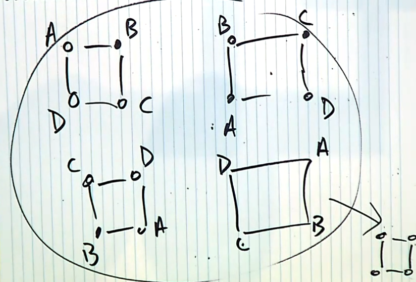
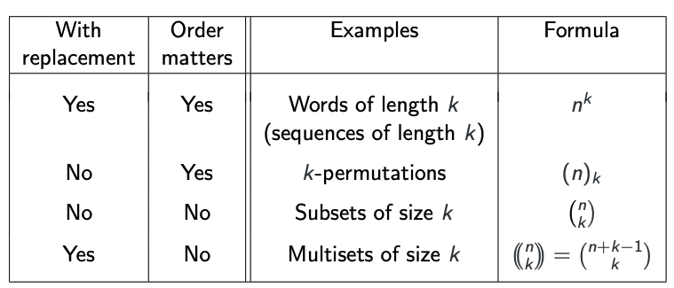
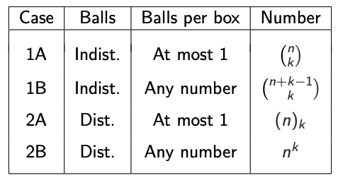

# **Combinatorics**
## **Intro**
### Combinatorics in Computer Science
* Computing cost functions in algorithmic analysis
* Identifyiing (in-)efficiencies in data management
* Developing effective techniques for enumerating objects
* Probability calculations
### Probability in Computer Science
* Artificial Intelligience
  * Machine Learning
  * Decision Theory
  * Image Processing
  * Speech Recoginition
* Algorithms
  * Algorithm Analysis
  * Big Data Sampling and Analysis
* Security
  * Cryptography
  * Quantum Computing
* Networks
  * Network Traffic Modelling
  * Reliability Modelling
### Statistics in Computer Science
* Sampling from large data sets
* Identifying Anomolies
* Making Predictions

***
## **Counting Principles**
**General Techniques:**  
Find methods, algorithms or precise formulae to count the number of elements in various sets or collections derived, in a structured way, from some basic sets.  
**Counting Rules: Principles**
* **Union Rule** ("or"): If $S$ and $T$ are disjoint, then $\mid S\cup T\mid=\mid S\mid + \mid T\mid$
* **Product Rule** ("followed by"): $\mid S\times T\mid=\mid S\mid \cdot \mid T\mid$  
  These cover many examples, though the rule application is not always obvious.  

Common Strategies:
* Direct application of the rule
* Relate unknown quantities to known quantities (e.g. $\mid S\mid + \mid T\mid = \mid S\cup T\mid + \mid S\cap T\mid$)
* Find a bijection to a set that can be counted

***
## **Basic Counting Rules: Union**
**Definition:** $S$ and $T$ disjoint,   
$\mid S\cup T\mid=\mid S\mid + \mid T\mid$  
$S_1, S_2,...,S_n$ pairwise disjoint ($S_i \cap S_j=\empty\ for\ i\neq j$)  
$\mid S_1\cup ...\cup S_n\mid = \sum\mid S_i\mid$.  
**Facts:** For any sets $X,Y,Z$ 
* $\mid Y \backslash X=\mid Y\mid - \mid X\cap Y\mid$
* $\mid X\cup Y\mid=\mid X\mid + \mid Y\mid - \mid X\cap Y\mid$
* $\mid X\cup Y \cup Z\mid = \mid X\mid + \mid Y\mid + \mid Z\mid - \mid X\cap Y\mid - \mid Y\cap Z\mid - \mid Z \cap X\mid + \mid X \cap Y\cap Z\mid$
* If $S\cup T=\mid S\mid + \mid T\mid$, then $S$ and $T$ are disjoint
* If $\mid \cup^n_{i=1}S_i\mid = \Sigma^n_{i=1}\mid S_i\mid$ then $S_i$ are pairwise disjoint
* If $\mid T\backslash S\mid = \mid T\mid - \mid S\mid$ then $S\subseteq T$
  These properties can serve to identify cases when sets are disjoint (resp. one is contained in the other)
   
***
## **Basic Counting Rules: Product**
**Definition:**  
$\mid S_1\times ...\times S_k\mid=\mid S_1\mid\cdot\mid S_2\mid\cdot\cdot\cdot\mid S_k\mid=\prod^k_{i=1}\mid S_i\mid$  
If all $S_i = S$ (the same set) and $\mid S\mid=m$ then $\mid S^k\mid=m^k$  
**Note:** This counts the number of sequences where the first item is from $S_1$, the second is from $S_2$, and so on.  

**Question: How can we count sequences when the underlying set changes?**  
To count sequences without replacement:
* Define an order on the whole underlying set
* Select from $[1,n]$, where $n$ is the size of the "remaining" set, and a selection of $i$ represents choosing the $i$-th element in that set
  
**Combinatorial Symmetry**  
* **Definition:** A $k-to-1$ function is a function that maps exactly $k$ inputs to an output  
* **Note:** A $k-to-1$ function defines the equivalence relation of a combinatorial symmetry and vice-versa  
* **Example:**   

A symmetry of a mathematical object is a bijective mapping from the object to itself which preserves "structure"  
A (combinatorial) symmetry defines an equivalence relation where the equivalence classes all have the same size  

**Product Rule:** Symmetries and Duplications  
The method for counting symmetric constraints and duplicates are same
* $S_1=\text{sequence accounting for symmetry}$
* $S_2=\text{symmetries}$
* $S=\text{sequences without symmetry}$
  $$S=S_1\times S_2$$
  so 
  $$\mid S_1\mid = \frac{\mid S\mid}{\mid S_2\mid}$$
  Alternatively, $\frac{1}{\mid S_2\mid}$ of the $\mid S\mid$ sequences meet the symmetric constraint

***
## **Combinations and Permutations**
**Permutations:**  
Ordering of all objects from a set $S$; equivalently: Selecting all
objects while recognising the order of selection.
The number of permutations of n elements is
$$n!=n\cdot (n-1)\cdot\cdot\cdot1, 0!=1!=1$$  
**r-permutations (sequences without repetition):**
Selecting any $r$ objects from a set $S$ of size $n$ <u>without repetition
while recognising the order of selection.</u>
Their number is
$$(n)_r= ^nP_r=n\cdot (n-1)\cdots (n-r+1)=\frac{n!}{(n-r)!}$$  
**r-selections (or: r-combinations):**  
Collecting any $r$ distinct objects <u>without repetition</u>;
equivalently: selecting $r$ objects from a set $S$ of size $n$ and <u>not
recognising the order of selection.</u> Their number is
$$(^n_r)=\frac{(n)_r}{r!}=\frac{n!}{(n-r)!r!}=\frac{n\cdot (n-1)\cdots(n-r+1)}{1\cdot 2\cdots r}$$  

**Note:** These numbers are usually called binomial coefficients due to  
$(a+b)^n=a^n+(^n_2)a^{n-2}b^2+\cdots+b^n=\Sigma^n_{i=0}(^n_i)a^{n-1}b^i$   
Also defined for any $\alpha\in \mathbb{R}$ as $(^\alpha_r)=\frac{\alpha(\alpha-1)\cdots(\alpha-r+1)}{r!}$

<u>**Selecting Items Summary:**</u>  
Selecting k items from a set of $n$ items: 

<u>**Balls in Boxes Method**</u>
Have $n$ "distinguishable" boxes  
Have $k$ balls which are either:  
1 Indistinguishable  
2 Distinguishable  
How many ways to place balls in boxes with:  
A At most one  
B Any number of   
balls per box?  
Note: Suppose $K$ is a set with $\mid K\mid=k$ and $N$ is a set with $\mid N\mid=n$:
* $2A$ counts the number of injective functions from $K$ to $N$
* $2B$ counts the number of functions from $K$ to $N$  
* 
