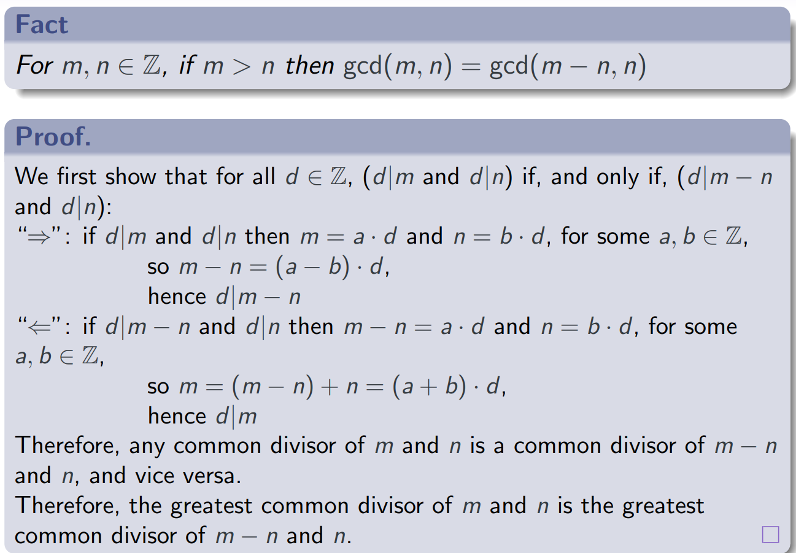

# **Number Teory**
## **Intro:**
**Applications of  Number Theory include:**
* Cryptography/Security (primes, divisibility)
* Large integer calculations (modular arithmetic)
* Date and time calculations (modular arithmetic)
* Solving optimization problems (integer linear programming)
* etc.
***

## **Numbers and Numerical Operations**
### **Denotions:**
* Nuatural Numbers $\mathbb{N} = \{0, 1, 2, ...\}$
* Integers $\mathbb{Z} = \{..., -1, 0, 1, 2, ...\}$
* Positive Integers $$\mathbb{N}_{>0} = \mathbb{Z}_{>0} = \{1, 2, ...\}$$
* Rational Numbers (Fractions) $\mathbb{Q} = \{\frac{m}{n} : m, n \in \mathbb{Z}, n \neq 0\}$
* Real Numbers (Decimal or Binary Expansions) $\mathbb{R} r = a_1a_2...a_k.b_1b_2...$

### **Floor and Ceiling**
* $\lfloor.\rfloor$ : Floor of $x$, the greatest integer $\leq x$.  
* $\lceil.\rceil$ : Ceiling of $x$, the least integer $\geq x$.  

Example: $\lfloor\pi\rfloor = 3 = \lceil e\rceil$  $\pi,e \in \mathbb{R}; \lfloor\pi\rfloor, \lceil e\rceil \in \mathbb{Z}$  
**Properties:**
* $\lfloor-x\rfloor = -\lceil x\rceil$
* For all $t \in \mathbb{Z}$:
  * $\lfloor x+t\rfloor = \lfloor x\rfloor + t$ and
  * $\lceil x+t\rceil = \lceil x\rceil + t$.  

**Fact:**  Let $k, m, n \in \mathbb{Z}$ such that $k > 0$ and $m \geq n$. <u>The number of multiples of $k$ between $n$ and $m$ (inclusive) is </u> $\lfloor \frac{m}{k} \rfloor - \lfloor \frac{n-1}{k} \rfloor$.  
**Explaination of the Fact:** Here, "The number ($x$) of multiples of $k$" means $x = k\cdot a (a \in\mathbb{Z})$. And the whole fact refers to the count/quantity of integers within the range from $n$ to $m$ (including $n$ and $m$) that are divisible by $k$ without leaving a remainder.

### **Absolute Value**
$$|x| = 
\begin{cases}
x,  \quad x \geq 0\\
-x, \quad x < 0
\end{cases}$$  
***

## **Divisibility**
### **Definition:** 
* $m \mid n$ refers to $m$ divides $n$ if $n=k\cdot m$  
* $m \nmid n$ is the negation of $m \mid n$.  

Also stated as ' $n$ is divisible by $m$'  
or '$m$ is a divisor of $n$'  
or '$n$ is a multiple of $m$'

**Note that:** 'If $\frac{n}{m}\in\mathbb{Z}$ when $m$ divides $n$', this statement is NOT correct.  
Becuase when considering 0,   
$0\mid 0$ -- '0 divides 0' is True, then $\frac{0}{0}$ makes no sense.   
And $0\mid 1$ -- '0 divides 1' is False, then $\frac{1}{0}$ also makes no sense.
***

## **Greatest Common Divisor and Least Common Multiple**
### **gcd and lcm**
**Definition:**
* $gcd(m,n)$ is the **greatest common divisor** of $m$ and $n, which is the largest positive $d$ such that $d \mid m$ and $d \mid n$.
* $lcm(m,n)$ is the **least common multiple** of $m$ and $n$, which is the smallest positive $k$ such that $m \mid k$ and $n \mid k$.  

**Note:** $gcd(m,n)$ and $lcm(m,n)$ are always taken as non-negative even if $m$ or $n$ is negatvie.  
**Fact:** $gcd(m,n) \cdot lcm(m,n) = \mid m \mid \cdot \mid n \mid$
### **Primes and Relatively Prime**
**Definition:**
* A number $n>1$ is **prime** if it is only divisble by $\pm 1$ and $\pm n$.
* $m$ and $n$ are **relatively prime** if $gcd(m,n) = 1$  
### **Euclid's gcd Algorithm**
$gcd(m,n) =
\begin{cases}
m \quad \quad \quad \quad \quad \quad if \quad m = n \\
gcd(m-n, n) \quad if \quad m > n \\
gcd(m, n-m) \quad if \quad m < n
\end{cases}$  
**Facts:**
* For $m > 0$, $n > 0$ the algorithm always terminates.
* For $m,n\in\mathbb{Z}$, if $m > n$ then $gcd(m,n)=gcd(m -kn,n)$
* For $m,n\in\mathbb{Z}$, if $m > n$ then $gcd(m,n)=gcd(m -n,n)$  

***

## **Modular Arithmetic**
### **Euclid's Division Lemma**
**Fact:** For $m\in\mathbb{Z}, n\in\mathbb{Z}_{>0}$ there $\exists q,r\in\mathbb{Z}$ with $0 \leq < n$ such that $m = q\cdot n +r$ 
### **Mod and Div**
Let $m,p\in\mathbb{Z},\quad n\in\mathbb{Z}_{>0}$  
* $m\ div\ n = \lfloor\frac{m}{n}\rfloor$
* $m\ \%\ n=m-(m\ div\ n)\cdot n$
* $m = _{(n)}p$ if $n \mid (m-p)$  
**Note that** $m = _{(n)}p$ is **NOT standard**. It is more commonly written as $m = p\ (mod\ n) \Leftrightarrow n \mid (m-p)$  
which refers to $m=kn+p$, here, $p \geq remainder$ depends on $k$. 

**Fact:**
* $0 \leq (m \ \% \ n) < n$
* $m = _{(n)}p$ if, and only if, $(m \ \% \ n)=(p\ \%\ n)$
* $m = _{(n)}(m\ \%\ n)$
* If $m = _{(n)}m'$ and $p=_{(n)}p'$ then:
  * $m+p=_{(n)}m'+p'$ and
  * $m\cdot p=_{(n)}m'+p'$  
    (Proof is shown in [Task1](/Tasks/Task1.md))

***
## **Euclidean Algorithm**
### **Faster Euclidean gcd Algorithm**
$gdc(m,n) = \begin{cases}
m \qquad \qquad \qquad \ \ \  if\ \ m=n\ or\ n=0\\
n \qquad \qquad \qquad \quad if\ \ m=0\\
gcd(m\ \%\ n,n)\quad \ \ if\ \ m>n>0 \\
gdc(m,n\ \%\ m)\quad \ if\ \ 0<m<n \\    
\end{cases}$  
**Fact:** For $m,n\in\mathbb{Z}$, if $m>n$ then $gcd(m,n)=gcd(m\ \%\ n,n)$  
Proof: Let $k = m\ div\ n$. Then $m\ \%\ n=m-k\cdot n$ 
