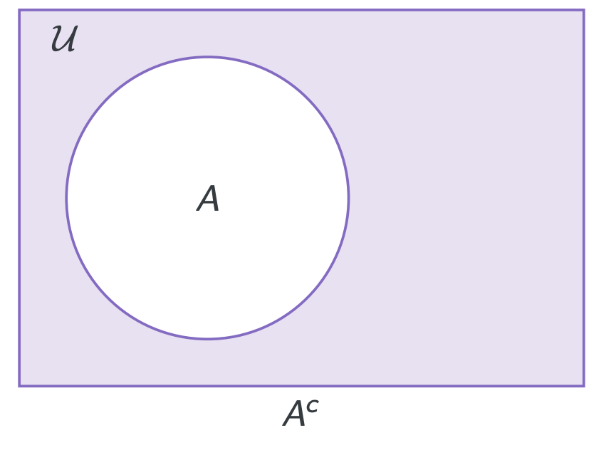
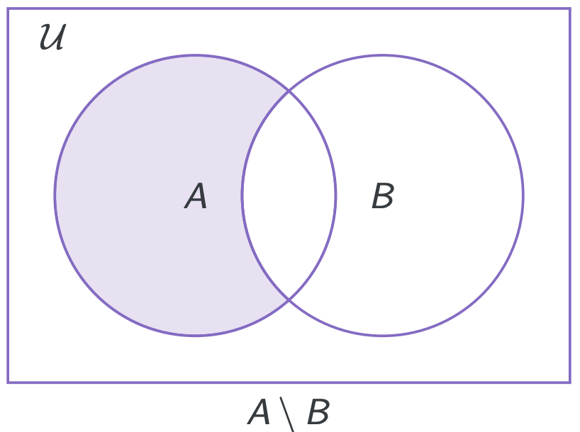
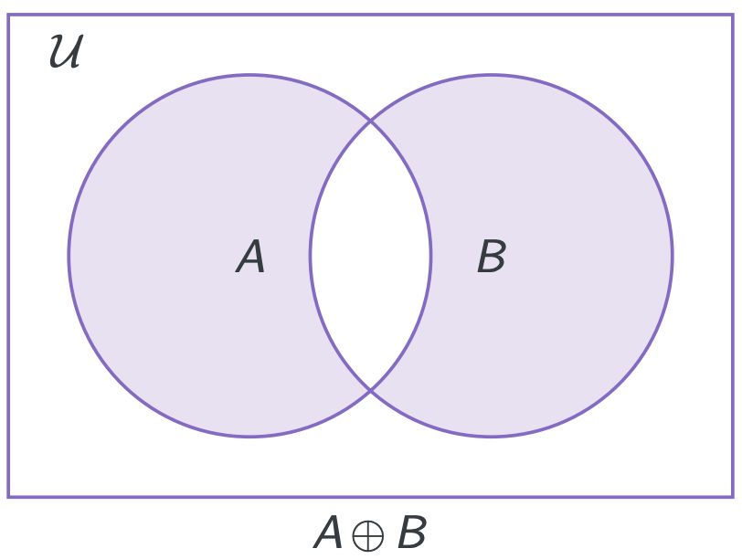

# **Sets**
## **Structure in Computer Science**
Intro of Sets:
* Sets are the building blocks of nearly all mathematical structures
* Data structures based around sets can be space-efficient storage system
* Set theory is a good introduction to formal reasoning (logic)

Intro of Formal Languages:
* Formal languages are essential for compilers and programming language design
* Formal languages provide a good introduction to recursive structures(recursion and induction)

Intro of Relations:
* Relations are the building blocks of nearly all structures used
in Computer Science
* Databases are collections of relations
* Any ordering is a relation
* Common data structures (e.g. graphs) are relations
* Functions/procedures/programs compute relations between
their input and output

Intro of Functions:
* Functions, methods, procedures in programming
* Computer programs “are” functions
* Graphical transformations
* Algorithmic analysis

  
Intro of Graphs:
* Route planning in navigation systems, robotics
* Optimisation, e.g. timetables, utilisation of network
structures, bandwidth allocation
* Compilers using “graph colouring” to assign registers to
program variables
* Circuit layout (Untangle game)
* Determining the significance of a web page (Google’s
pagerank algorithm)
* Modelling the spread of a virus in a computer network or news
in social network 
***

## **Introduction to Sets**
### **Sets:**
**Definition:** A set is a collection of objects (elements). if $x$ is an element of $A$ we denote it as $x\in A$.  
* A set is defined by the collection of its elements. Order and multiplicity of elements is not considered.
* We distinguish between an element and the set comprising this single element. Thus always $a \neq\set{a}$
* Set $\emptyset = \set{}$ is empty (no elements)
* Set $\set{\set{}}$ is nonempty -- it has one element.
* No duplication in a Set.  

Note:
* Elements are taken from a universe, $\mathcal{U}$, – but this can be
quite complex. e.g. numbers, and sets of numbers, and sets of
sets of numbers, etc.
* Not all “well-defined” universes are possible. e.g.
  * No “set of all sets” (Cantor’s paradox)
  * No “sets which do not contain themselves” (Russell’s paradox)

### **Subsets:**
For sets $S$ and $T$, we say $S$ is a subset of $T$, denoted as $S\subseteq{T}$, if every element of $S$ is an element of $T$.  
Note:  
* $S \subseteq T$ includes the case of $S=T$
* $S \subset T$ -- a proper subset: $S \subseteq T$ and $S \neq T$
* $\emptyset \subseteq S$ for all sets $S$
* $S \subseteq \mathcal{U}$ for all sets $S$
* $\mathbb{N}_{>0}\sub\mathbb{N}\sub\mathbb{Z}\sub\mathbb{Q}\sub\mathbb{R}$
* An element of a set; and a subset of that set are two different
concepts  
  * $a\in\set{a,b}, a\subsetneq\set{a,b};$  
  * $\set{a}\subseteq\set{a,b}, \set{a}\notin\set{a,b}$

*** 
## **Defining Sets**
Sets are typically described by:
* Explicit enumeration of their elements.
* Defining a subset of the universal set $\mathcal{U}$. Including:
  * Specifying the properties their elements must satisfy.
  * Derived sets of integers
  * Using interval notation ($[a,b]/(a,b)/[a,b)/(a,b]$)
  Note that $(a,a)=(a,a]=[a,a)=\emptyset$;   
  however $[a,a]=\set{a}$
* Constructions from other, already defined , sets
  * Union($\cup$), intersection($\cap$), complement($\cdot^{c}$), set difference(\\), symmetric difference($\oplus$) 
  * Power set $POW(X)=\{A:A\subseteq X\}$ ([Power Set Intro](https://en.wikipedia.org/wiki/Power_set))
  * Cartesian product($\times$)
  
***
## **Set Operations:**
* $A\cup B$ -- **union** ($a$ or $b$): $A\cup B=\{x:x\in A\ or\ x\in B\}$  
* $A\cap B$ -- **intersection** ($a$ and $b$): $A\cap B = \{x:x\in A\ and\ x\in B\}$  
  If $A\cap B=\emptyset$, we say that $A$ and $B$ are **disjoint**.  
* $A^c$ -- **complement** (with respect to a universal set $\mathcal{U}$): $A^c = \{x:x\in \mathcal{U}\ and\ x \notin A\}$  
We say that $A$, $B$ are disjoint if $A\cap B=\emptyset$  

* $A\backslash B$ -- **set difference**, relative complement ($a$ but not $b$):   
  $A\backslash B=A\cap B^c$  

* $A\oplus B$ -- **symmetric difference** ($a$ and not $b$ or $b$ and not $a$; also known as $a$ or $b$ exclusively; $a$ xor $b$):  
$A\oplus B = (A\backslash B)\cup (B\backslash A)$
  
**Fact:** $A \cup B = B$ iff $A\cap B=A$ iff $A\subseteq B$
* **Power Set:** $POW(X)$ is the set of all subsets of $X$
* **Cardinality:** The cardinality of a set $X$ (various notation) is the number of elements in that set. Denoted as:  
$\mid X\mid = \#(X)=card(X)$  
**Fact:** Always there is $\mid POW(X)\mid=2^{\mid X\mid}$
* **Cartesian Product:**  
The Cartesian Product of two sets $S$ and $T$ is the set of ordered pairs:  
$S\times T \overset{\operatorname{def}}{=}\set{(s,t):s\in S,t\in T}$  
The Cartesian Product of a collection of $n$ sets $S_1,S_2,...,S_n$ is the set of ordered n-tuples:  
$\times ^{n}_{i=1}S_i\overset{\operatorname{def}}{=}\set{(s_1,s_2,...,s_n):s_k\in S_k, for\ 1\leq k\leq n}$  
When all the $S_i$ are equal:  
$S^2=S\times S$, $S^3=S\times S\times S$, $S^n=\times ^{n}_{i=1}S_i$  
**Note that:**  
$A\times (B\times C)\neq (A\times B)\times C$  
**Fact:**  
  * $\emptyset\times S = \emptyset$, for every $S$
  * $\mid S\times T\mid = \mid S\mid\cdot\mid T\mid$
  * $\mid \times ^{n}_{i=1}S_i\mid = \prod^{n}_{i=1}\mid S_i\mid$  

***
***
# **Formal Languages**
## **Symbols**
Represented as $\Sigma$ -- **alphabet**, a finite, nonempty set.  
E.g.  
* $\Sigma = \set{a,b,...,z}$ -- for single words in lower case
* $\Sigma = \set{0,1}$ -- for binary integers
* $\Sigma = \set{0,1,2,...,9}$ -- for decimal integers
***
## **Words, Sets of Words, Languages**
### **Words：**
A **word** s a finite string (sequence) of symbols from $\Sigma$.  
The **empty word**, $\lambda$, is the unique word with no symbols. ($length(\lambda)=0$)  
$\lambda w= w = w\lambda$
### **Sets of Words:**
* $\Sigma^k$ or $\Sigma^{=k}$: The set of all words of length $k$
* $\Sigma^{\leq k}$: The set of all words of length at most $k$
* $\Sigma^*$: The set of all finite words
* $\Sigma^+$: The set of all nonempty words  

We often identify $\Sigma^1=\Sigma$  
$\Sigma^*=\Sigma^0\cup\Sigma^1\cup\Sigma^2\cup...$  
$\Sigma^{\leq n}=\cup^n_{i=0}\Sigma^i$  
$\Sigma^+=\Sigma^1\cup\Sigma^2\cup ...=\Sigma^*\backslash\{\lambda\}$ (means except $\lambda$ here)  
$\emptyset^*=\set{\lambda}$  
$\set{\lambda}^*=\set{\lambda}$
### **Languages:**
A language is a subset of $\Sigma^*$  
Typically, only the subsets that can be formed (or described) according to certain rules are of interest. Such a collection of 'descriptive/formative' rules is called a **Grammar**.  
E.g:  
123, 123.0, 123.00 can be all **distinct** words in a certain language with a certain grammar.
***
## **Set Operations for Languages**
Languages are sets, so the **standard set operations** ($\cap,\cup,\backslash,\oplus,etc$) can be used to build new languages.
There are 2 set operations that apply to languages uniquely:
* **Concatenation**: (It is totally different from Cartesian Product $\times$)  
$XY=\set{xy:x\in X\ and\ y\in Y}$
* **Kleene Star**: $X^*$ is the set of words that are made up by concatenating 0 or more words in $X$  
  * $X^0=\set{\lambda}$; $X^{i+1}=XX^i$. Recursive Inductive.
  * $X^*=X^0\cup X^1\cup X^2\cup ...$

**Note:** The set of all finite words over $\Sigma$ is the Kleene star of $\Sigma$ (hence notation).  
**E.g.** Difference between Concatenation and Cartesian Product.  
if $L_1=\set{0,0,0}$, $L_2=\set{1,01}$  
Then, $L_1\times L_2=\set{(0,1),(00,1),(0,01),(00,01)}$  
$L_1L_2=\set{01,001,0001}$  
$A\times B\times C\neq A\times (B\times C)$  
$ABC=A(BC)=(AB)C$  

