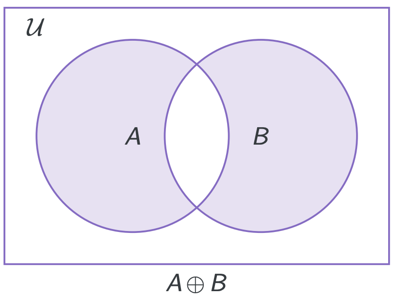

# **Sets**
## **Structure in Computer Science**
Intro of Sets:
* Sets are the building blocks of nearly all mathematical structures
* Data structures based around sets can be space-efficient storage system
* Set theory is a good introduction to formal reasoning (logic)

Intro of Formal Languages:
* Formal languages are essential for compilers and programming language design
* Formal languages provide a good introduction to recursive structures(recursion and induction)

Intro of Relations:
* aa

Intro of Functions:
*  aa
  
Intro of Graphs:
* 
***

## **Introduction to Sets**
### **Sets:**
A set is a collection of objects (elements). if $x$ is an element of $A$ we denote it as $x\in A$.  
* A set is defined by the collection of its elements. Order and multiplicity of elements is not considered.
* We distinguish between an element and the set comprising this single element. Thus always $a \neq\set{a}$
* Set $\emptyset = \set{}$ is empty (no elements)
* Set $\set{\set{}}$ is nonempty -- it has one element.
* No duplication in a Set.  

Note:
* Elements are taken...

### **Subsets:**
For sets $S$ and $T$, we say $S$ is a subset of $T$, denoted as $S\subseteq{T}$, if every element of $S$ is an element of $T$.  
......
*** 
## **Defining Sets**
Sets are typically described by:
* Explicit enumeration of their elements.
* Defining a subset of the universal set $\mathcal{U}$. Including:
  * Specifying the properties their elements must satisfy.
  * Derived sets of integers
  * Using interval notation ($[a,b]/(a,b)/[a,b)/(a,b]$)
  Note that $(a,a)=(a,a]=[a,a)=\emptyset$;   
  however $[a,a]=\set{a}$
* Constructions from other, already defined , sets
  * Union($\cup$), intersection($\cap$), complement($\cdot^{c}$), set difference(\\), symmetric difference($\oplus$) 
  * Power set $POW(X)=\{A:A\subseteq X\}$
  * Cartesian product($\times$)
  
***
## **Set Operations:**
* $A\cup B$ -- **union** ($a$ or $b$): $A\cup B=\{x:x\in A\ or\ x\in B\}$  
* $A\cap B$ -- **intersection** ($a$ and $b$): $A\cap B = \{x:x\in A\ and\ x\in B\}$  
* $A^c$ -- **complement** (with respect to a universal set $\mathcal{U}$): $A^c = \{x:x\in \mathcal{U}\ and\ x \notin A\}$  
We say that $A$, $B$ are disjoint if $A\cup B=\emptyset$  

* $A\backslash B$ -- **set difference**, relative complement ($a$ but not $b$): $A\backslash B=A\cup B^c$  

* $A\oplus B$ -- **symmetric difference** ($a$ and not $b$ or $b$ and not $a$; also known as $a$ or $b$ exclusively; $a$ xor $b$): $A\oplus B = (A\backslash B)\cup (B\backslash A)$

**Fact:** $A \cup B = B$ iff $A\cap B=A$ iff $A\subseteq B$
